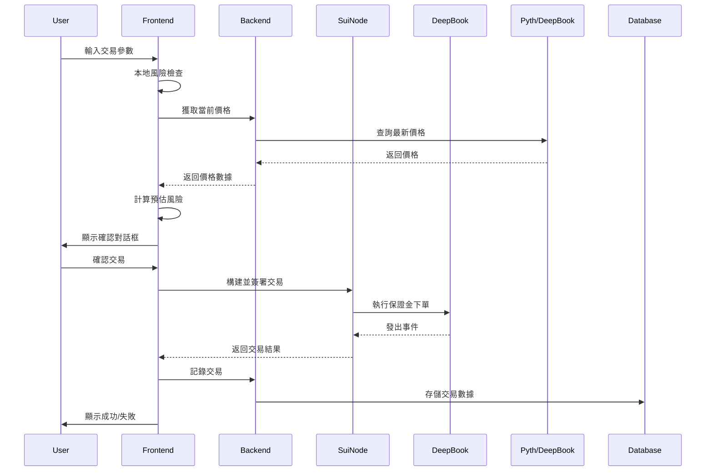
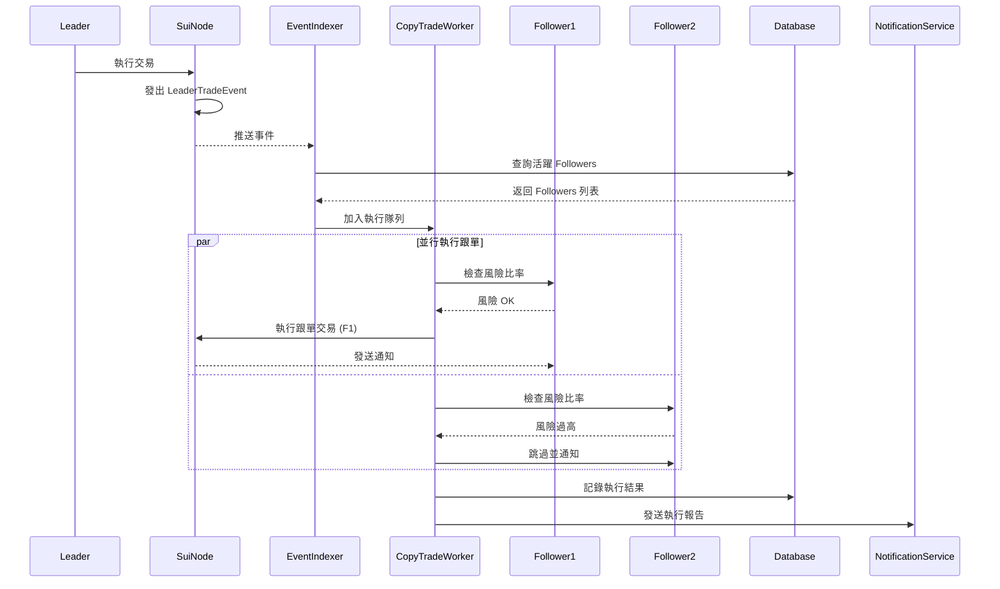
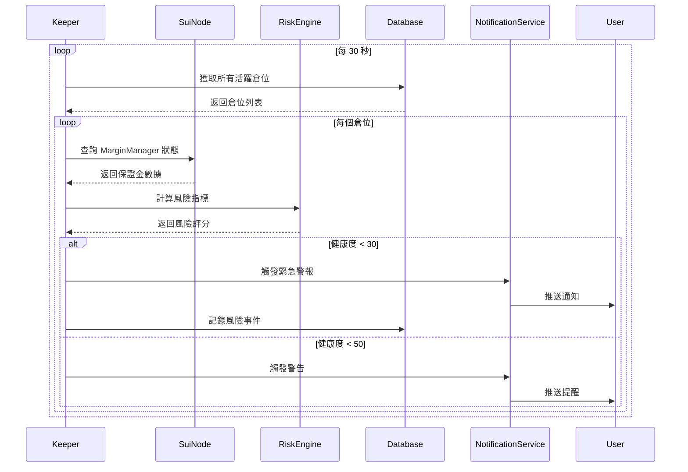

# MarginMaster - 最終完整設計文檔

> **版本:** 2.0 (優化版)
> **日期:** 2026-02-02
> **狀態:** Ready for Implementation
> **預計開發時間:** 7 天 (Hackathon) + 後續迭代

---

## 📋 目錄

1. [執行摘要](#執行摘要)
2. [產品概述](#產品概述)
3. [市場分析](#市場分析)
4. [系統架構](#系統架構)
5. [技術棧](#技術棧)
6. [核心功能模組](#核心功能模組)
7. [智能合約設計](#智能合約設計)
8. [前端架構](#前端架構)
9. [後端架構](#後端架構)
10. [數據庫設計](#數據庫設計)
11. [API 設計](#api-設計)
12. [風險管理系統](#風險管理系統)
13. [安全性設計](#安全性設計)
14. [性能優化](#性能優化)
15. [開發計劃](#開發計劃)
16. [測試策略](#測試策略)
17. [部署方案](#部署方案)
18. [未來擴展路線圖](#未來擴展路線圖)
19. [附錄](#附錄)

---

## 執行摘要

### 項目定位

**MarginMaster** 是基於 Sui 區塊鏈和 DeepBook Margin 協議的**社交化保證金交易平台**，結合複製交易、AI 風險管理和交易者排行榜功能，旨在降低 DeFi 保證金交易門檻並提供透明的社交交易體驗。

### 核心價值主張

| 維度 | 價值 |
|------|------|
| **時機優勢** | DeepBook Margin 於 2025/1 推出，市場空缺明顯 |
| **技術優勢** | Sui 低 gas + 快速確認，完美適配高頻跟單 |
| **商業模式** | 雙重收入：DeepBook 推薦獎勵 + 跟單費用分成 |
| **競爭優勢** | Sui 生態首個社交化保證金交易平台 |
| **可行性** | 基於成熟 SDK，7 天可完成 MVP |

### 關鍵指標目標

**Hackathon 階段 (7 天)**
- ✅ 完整的保證金交易界面
- ✅ 可運作的一鍵跟單系統
- ✅ Top 10 交易者排行榜
- ✅ 實時風險警報系統
- ✅ 完整的 Demo 影片

**Post-Hackathon (1 個月)**
- 🎯 100+ 活躍用戶
- 🎯 10+ 認證交易者
- 🎯 $100K+ 累計交易量
- 🎯 50+ 活躍跟單關係

**長期目標 (6 個月)**
- 🎯 1000+ 活躍用戶
- 🎯 $10M+ 月交易量
- 🎯 策略市場上線
- 🎯 移動 App 發布

---

## 產品概述

### 核心功能

#### 1. 保證金交易面板
- 市價單 / 限價單支持
- 1x - 10x 槓桿選擇
- 實時風險指標顯示
- 預估清算價格計算
- 一鍵止損/止盈設置

#### 2. 社交跟單系統
- **一鍵跟單** - 自動複製交易者的所有操作
- **自定義跟單比例** - 1%-100% 靈活調整
- **智能風險控制** - 自動檢查跟單前風險比率
- **實時狀態同步** - 跟單執行成功/失敗通知
- **費用透明** - 明確的跟單費率顯示

#### 3. 交易者排行榜
- **多維度排名**
  - 30 天盈虧 (PnL)
  - 勝率 (Win Rate)
  - 夏普比率 (Sharpe Ratio)
  - 最大回撤 (Max Drawdown)
  - 跟隨者數量
- **詳細檔案頁**
  - 歷史績效圖表
  - 最近交易記錄
  - 跟隨者列表
  - 交易風格標籤

#### 4. AI 風險管理
- **實時風險評分** - 0-100 分健康度評分
- **智能警報系統**
  - 接近清算提醒
  - 保證金使用率過高警告
  - 市場波動率預警
- **自動化建議**
  - 建議止損價位
  - 建議減倉比例
  - 風險對沖策略

#### 5. 模擬交易模式（新增）
- 新手無風險練習環境
- 虛擬資金模擬真實交易
- 績效追蹤與學習分析

### 用戶旅程

#### 新手用戶流程
```
註冊並連接錢包
    ↓
進入模擬交易模式（推薦）
    ↓
瀏覽排行榜，選擇心儀交易者
    ↓
查看交易者詳細檔案與績效
    ↓
設置跟單參數（比例、最大倉位）
    ↓
啟用跟單並接收實時通知
    ↓
監控風險儀表板
    ↓
（可選）升級為真實交易
```

#### 交易者流程
```
連接錢包並創建 Margin Manager
    ↓
完成交易者認證（可選）
    ↓
進行保證金交易
    ↓
系統自動發布交易信號
    ↓
Followers 自動跟單
    ↓
獲得跟單費用分成
    ↓
提升排名，吸引更多 Followers
```

---

## 市場分析

### 目標市場

#### 主要用戶群體

1. **DeFi 新手交易者** (40%)
   - 想參與保證金交易但缺乏經驗
   - 願意付費跟隨成功交易者
   - 風險承受能力：低-中

2. **經驗豐富的交易者** (30%)
   - 尋求額外收入來源（跟單費用）
   - 願意分享策略以建立個人品牌
   - 風險承受能力：中-高

3. **量化交易團隊** (20%)
   - 尋求策略變現渠道
   - 需要低延遲執行環境
   - 風險承受能力：高

4. **策略研究者** (10%)
   - 測試與優化交易策略
   - 需要回測與分析工具
   - 風險承受能力：中

### 競爭分析

#### 現有競爭者

| 平台 | 類型 | 優勢 | 劣勢 |
|------|------|------|------|
| **DeepTrade** | DeepBook 前端 | 官方推薦，功能完整 | 缺乏社交功能 |
| **Abyss** | DeFi 聚合器 | 多協議支持 | 保證金交易不是重點 |
| **Turbos** | DEX + NFT | 用戶基礎大 | 未專注於 Margin |
| **eToro** (CEX) | 社交交易 | 成熟的跟單系統 | 中心化，非 DeFi |
| **Bybit** (CEX) | 複製交易 | 流動性強 | 中心化，高費用 |

#### MarginMaster 差異化優勢

✅ **Sui 生態首個** 專注於保證金交易的社交平台
✅ **完全透明** 鏈上可驗證的交易記錄與績效
✅ **低成本** Sui 低 gas 費支持高頻跟單
✅ **快速執行** 亞秒級確認時間，減少滑點
✅ **AI 增強** 智能風險管理與交易建議
✅ **雙重激勵** DeepBook 積分 + 跟單費用

### 市場規模估算

**TAM (Total Addressable Market)**
- 全球 DeFi 用戶：~700 萬
- 保證金交易參與率：~15%
- **潛在用戶：~100 萬**

**SAM (Serviceable Addressable Market)**
- Sui 生態用戶：~50 萬
- DeFi 活躍用戶比例：~20%
- **可觸及用戶：~10 萬**

**SOM (Serviceable Obtainable Market)**
- Year 1 目標市場份額：5%
- **首年目標用戶：~5,000**

---

## 系統架構

### 高層架構圖

```
┌─────────────────────────────────────────────────────────────────┐
│                        用戶界面層 (Web App)                        │
│  ┌──────────┐  ┌──────────┐  ┌──────────┐  ┌──────────┐         │
│  │交易面板  │  │排行榜    │  │跟單管理  │  │風險儀表板│         │
│  └──────────┘  └──────────┘  └──────────┘  └──────────┘         │
│  ┌──────────┐  ┌──────────┐  ┌──────────┐  ┌──────────┐         │
│  │個人檔案  │  │通知中心  │  │模擬模式  │  │策略市場  │         │
│  └──────────┘  └──────────┘  └──────────┘  └──────────┘         │
└─────────────────────────────────────────────────────────────────┘
                              ↕ HTTPS/WSS
┌─────────────────────────────────────────────────────────────────┐
│                  應用邏輯層 (React + TypeScript)                   │
│  ┌──────────┐  ┌──────────┐  ┌──────────┐  ┌──────────┐         │
│  │狀態管理  │  │API客戶端 │  │錢包集成  │  │事件監聽  │         │
│  │(Zustand) │  │(React    │  │(@mysten/ │  │(WebSocket│         │
│  │          │  │ Query)   │  │ dapp-kit)│  │)         │         │
│  └──────────┘  └──────────┘  └──────────┘  └──────────┘         │
│  ┌──────────┐  ┌──────────┐  ┌──────────┐  ┌──────────┐         │
│  │風險計算  │  │圖表渲染  │  │本地快取  │  │錯誤處理  │         │
│  │引擎      │  │(Recharts)│  │(IndexedDB│  │(Sentry)  │         │
│  └──────────┘  └──────────┘  └──────────┘  └──────────┘         │
└─────────────────────────────────────────────────────────────────┘
                              ↕ JSON-RPC / REST
┌─────────────────────────────────────────────────────────────────┐
│                      後端服務層 (Node.js)                          │
│  ┌──────────┐  ┌──────────┐  ┌──────────┐  ┌──────────┐         │
│  │REST API  │  │事件索引器│  │排行榜計算│  │通知服務  │         │
│  │(Express) │  │(Sui      │  │(Redis +  │  │(Novu)    │         │
│  │          │  │ Events)  │  │ Cron)    │  │          │         │
│  └──────────┘  └──────────┘  └──────────┘  └──────────┘         │
│  ┌──────────┐  ┌──────────┐  ┌──────────┐  ┌──────────┐         │
│  │跟單執行器│  │價格獲取  │  │風險監控  │  │Analytics │         │
│  │(Queue    │  │(Pyth/    │  │Keeper    │  │(Mixpanel)│         │
│  │ Worker)  │  │ DeepBook)│  │          │  │          │         │
│  └──────────┘  └──────────┘  └──────────┘  └──────────┘         │
└─────────────────────────────────────────────────────────────────┘
                              ↕ SQL / Redis
┌─────────────────────────────────────────────────────────────────┐
│                      數據存儲層                                     │
│  ┌──────────────────────┐  ┌──────────────────────┐              │
│  │  PostgreSQL          │  │  Redis Cache         │              │
│  │  - 用戶資料          │  │  - 排行榜快取        │              │
│  │  - 跟單關係          │  │  - 會話管理          │              │
│  │  - 交易記錄          │  │  - 實時價格          │              │
│  │  - 績效統計          │  │  - 任務隊列          │              │
│  └──────────────────────┘  └──────────────────────┘              │
└─────────────────────────────────────────────────────────────────┘
                              ↕ Transaction / Query
┌─────────────────────────────────────────────────────────────────┐
│                   智能合約層 (Sui Move)                            │
│  ┌──────────┐  ┌──────────┐  ┌──────────┐  ┌──────────┐         │
│  │跟單管理  │  │交易者檔案│  │費用分配  │  │風險檢查  │         │
│  │模組      │  │模組      │  │模組      │  │模組      │         │
│  └──────────┘  └──────────┘  └──────────┘  └──────────┘         │
│  ┌──────────┐  ┌──────────┐  ┌──────────┐  ┌──────────┐         │
│  │自動觸發器│  │用戶註冊  │  │緊急暫停  │  │策略金庫  │         │
│  │模組      │  │模組      │  │模組      │  │(Phase 2) │         │
│  └──────────┘  └──────────┘  └──────────┘  └──────────┘         │
└─────────────────────────────────────────────────────────────────┘
                              ↕ Move Calls
┌─────────────────────────────────────────────────────────────────┐
│                    DeepBook Margin Layer                          │
│  ┌──────────┐  ┌──────────┐  ┌──────────┐  ┌──────────┐         │
│  │Margin    │  │Pool Proxy│  │Order Book│  │Liquidation│        │
│  │Manager   │  │          │  │          │  │Engine     │        │
│  └──────────┘  └──────────┘  └──────────┘  └──────────┘         │
└─────────────────────────────────────────────────────────────────┘
                              ↕
┌─────────────────────────────────────────────────────────────────┐
│                   數據索引層 (混合方案)                            │
│  ┌──────────────────────┐  ┌──────────────────────┐              │
│  │ Surflux Indexer      │  │ 自建事件索引器       │              │
│  │ - DeepBook交易數據   │  │ - 跟單事件           │              │
│  │ - 價格與行情         │  │ - 風險事件           │              │
│  │ - 流動性數據         │  │ - 績效更新           │              │
│  └──────────────────────┘  └──────────────────────┘              │
└─────────────────────────────────────────────────────────────────┘
                              ↕
┌─────────────────────────────────────────────────────────────────┐
│                      外部服務層                                     │
│  ┌──────────┐  ┌──────────┐  ┌──────────┐  ┌──────────┐         │
│  │Pyth      │  │Sui Full  │  │IPFS      │  │Email/SMS │         │
│  │Price Feed│  │Node RPC  │  │(策略存儲)│  │Gateway   │         │
│  └──────────┘  └──────────┘  └──────────┘  └──────────┘         │
└─────────────────────────────────────────────────────────────────┘
```

### 數據流架構

#### 1. 交易下單流程



#### 2. 跟單執行流程（優化版）



#### 3. 風險監控流程



---

## 技術棧

### 前端技術棧

```json
{
  "framework": "React 18.2+",
  "language": "TypeScript 5.3+",
  "build_tool": "Vite 5.0+",
  "styling": "Tailwind CSS 3.4+ / CSS Modules",
  "state_management": {
    "global": "Zustand 4.4+",
    "server_state": "TanStack Query (React Query) 5.0+",
    "forms": "React Hook Form 7.48+"
  },
  "wallet_integration": {
    "primary": "@mysten/dapp-kit 0.14+",
    "alternative": "@suiet/wallet-kit 0.2+"
  },
  "blockchain": {
    "sui_sdk": "@mysten/sui.js 0.50+",
    "deepbook": "deepbook-sdk (if available)"
  },
  "charts": {
    "trading_view": "lightweight-charts 4.1+",
    "analytics": "recharts 2.10+"
  },
  "utilities": {
    "date": "date-fns 3.0+",
    "numbers": "bignumber.js 9.1+",
    "notifications": "react-hot-toast 2.4+",
    "forms_validation": "zod 3.22+"
  },
  "testing": {
    "unit": "vitest 1.0+",
    "component": "@testing-library/react 14.0+",
    "e2e": "playwright 1.40+"
  },
  "monitoring": {
    "errors": "@sentry/react 7.90+",
    "analytics": "@mixpanel/browser 2.48+"
  }
}
```

### 後端技術棧

```json
{
  "runtime": "Node.js 20 LTS",
  "language": "TypeScript 5.3+",
  "framework": "Express 4.18+ / Fastify 4.25+",
  "database": {
    "primary": "PostgreSQL 16+",
    "cache": "Redis 7.2+",
    "orm": "Prisma 5.7+ / Drizzle ORM 0.29+"
  },
  "blockchain": {
    "sui_sdk": "@mysten/sui.js 0.50+",
    "event_listener": "custom (WebSocket based)"
  },
  "task_queue": {
    "library": "BullMQ 5.0+",
    "backend": "Redis"
  },
  "price_feeds": {
    "primary": "@pythnetwork/client 2.16+",
    "fallback": "DeepBook mid-price"
  },
  "notification": {
    "engine": "@novu/node 0.22+",
    "channels": ["email", "push", "in-app"]
  },
  "api": {
    "rest": "Express Router",
    "validation": "zod 3.22+",
    "rate_limiting": "express-rate-limit 7.1+"
  },
  "testing": {
    "unit": "vitest 1.0+",
    "integration": "supertest 6.3+",
    "mocking": "@faker-js/faker 8.3+"
  },
  "monitoring": {
    "apm": "@sentry/node 7.90+",
    "logging": "pino 8.17+",
    "metrics": "prom-client 15.1+"
  }
}
```

### 智能合約技術棧

```json
{
  "language": "Sui Move",
  "compiler": "Move Compiler 1.16+",
  "testing": "Sui Move Test Framework",
  "deployment": {
    "tool": "sui client CLI",
    "networks": ["devnet", "testnet", "mainnet"]
  },
  "dependencies": {
    "sui_framework": "0x2 (built-in)",
    "deepbook_margin": "DeepBook Margin Package",
    "deepbook_core": "DeepBook Core Package"
  },
  "development": {
    "linter": "move-analyzer",
    "formatter": "move fmt",
    "security": "Sui Move Prover (formal verification)"
  }
}
```

### 基礎設施

```json
{
  "hosting": {
    "frontend": "Vercel / Netlify",
    "backend": "Railway / Render / Fly.io",
    "database": "Supabase / Neon (managed PostgreSQL)"
  },
  "cdn": "Cloudflare CDN",
  "storage": {
    "assets": "Cloudflare R2 / AWS S3",
    "ipfs": "Pinata (for strategies)"
  },
  "monitoring": {
    "uptime": "Better Uptime",
    "logs": "Axiom / Logtail",
    "metrics": "Grafana Cloud"
  },
  "ci_cd": {
    "platform": "GitHub Actions",
    "containerization": "Docker (optional)"
  },
  "blockchain_infrastructure": {
    "rpc": "Sui Foundation Public RPC",
    "indexer": "Surflux DeepBook Indexer",
    "oracle": "Pyth Network"
  }
}
```

---

## 核心功能模組

### 模組一：保證金交易系統

#### 功能描述

提供完整的 DeepBook Margin 交易界面，支持市價單、限價單、槓桿選擇和實時風險監控。

#### 組件架構

```
TradingModule/
├── components/
│   ├── TradingPanel.tsx          # 主交易面板
│   ├── OrderForm.tsx              # 訂單表單
│   ├── PositionList.tsx           # 持倉列表
│   ├── OrderHistory.tsx           # 歷史訂單
│   ├── MarketDepth.tsx            # 市場深度圖
│   └── PriceChart.tsx             # 價格走勢圖
├── hooks/
│   ├── useTradingPanel.ts         # 交易面板邏輯
│   ├── useMarginManager.ts        # Margin Manager 管理
│   ├── useOrderBook.ts            # 訂單簿數據
│   └── usePositions.ts            # 持倉管理
├── services/
│   ├── deepbook.ts                # DeepBook API 封裝
│   ├── marginManager.ts           # Margin Manager 操作
│   └── orderExecution.ts          # 訂單執行邏輯
└── types/
    ├── trading.ts                 # 交易相關類型
    └── orders.ts                  # 訂單類型定義
```

#### 核心邏輯

**1. Margin Manager 創建與管理**

```typescript
// services/marginManager.ts

import { TransactionBlock } from '@mysten/sui.js/transactions';
import { SuiClient } from '@mysten/sui.js/client';

export interface MarginManagerConfig {
  poolId: string;
  initialCollateral: bigint;
  collateralType: 'SUI' | 'USDC';
}

export class MarginManagerService {
  constructor(
    private suiClient: SuiClient,
    private packageId: string
  ) {}

  /**
   * 創建新的 Margin Manager
   */
  async createMarginManager(
    config: MarginManagerConfig,
    userAddress: string
  ): Promise<string> {
    const tx = new TransactionBlock();

    // 準備抵押品
    const [collateralCoin] = tx.splitCoins(tx.gas, [
      tx.pure(config.initialCollateral)
    ]);

    // 調用 DeepBook Margin 創建 Manager
    tx.moveCall({
      target: `${this.packageId}::margin_manager::create`,
      arguments: [
        tx.object(config.poolId),
        collateralCoin,
      ],
      typeArguments: [
        config.collateralType === 'SUI' ? '0x2::sui::SUI' : '0x...::usdc::USDC'
      ]
    });

    const result = await this.suiClient.signAndExecuteTransactionBlock({
      transactionBlock: tx,
      sender: userAddress,
      options: {
        showEffects: true,
        showObjectChanges: true,
      }
    });

    // 提取創建的 Margin Manager ID
    const managerObject = result.objectChanges?.find(
      obj => obj.type === 'created' && obj.objectType.includes('MarginManager')
    );

    if (!managerObject || managerObject.type !== 'created') {
      throw new Error('Failed to create Margin Manager');
    }

    return managerObject.objectId;
  }

  /**
   * 查詢 Margin Manager 狀態
   */
  async getMarginManagerState(managerId: string) {
    const object = await this.suiClient.getObject({
      id: managerId,
      options: { showContent: true, showType: true }
    });

    if (!object.data?.content || object.data.content.dataType !== 'moveObject') {
      throw new Error('Invalid Margin Manager object');
    }

    const fields = object.data.content.fields as any;

    return {
      poolId: fields.pool_id,
      baseBalance: BigInt(fields.base_balance),
      quoteBalance: BigInt(fields.quote_balance),
      borrowedBase: BigInt(fields.borrowed_base),
      borrowedQuote: BigInt(fields.borrowed_quote),
      entryPrice: BigInt(fields.entry_price),
      riskRatio: this.calculateRiskRatio(fields),
    };
  }

  /**
   * 計算風險比率
   */
  private calculateRiskRatio(fields: any): number {
    const baseBalance = BigInt(fields.base_balance);
    const quoteBalance = BigInt(fields.quote_balance);
    const borrowedBase = BigInt(fields.borrowed_base);
    const borrowedQuote = BigInt(fields.borrowed_quote);

    // 需要當前價格，這裡簡化處理
    // 實際應從 price oracle 獲取
    const currentPrice = BigInt(fields.entry_price);

    const totalAssets = baseBalance * currentPrice + quoteBalance;
    const totalDebt = borrowedBase * currentPrice + borrowedQuote;

    if (totalDebt === 0n) return Infinity;

    return Number(totalAssets * 10000n / totalDebt) / 10000;
  }

  /**
   * 增加保證金
   */
  async addCollateral(
    managerId: string,
    amount: bigint,
    userAddress: string
  ): Promise<void> {
    const tx = new TransactionBlock();

    const [coin] = tx.splitCoins(tx.gas, [tx.pure(amount)]);

    tx.moveCall({
      target: `${this.packageId}::margin_manager::add_collateral`,
      arguments: [
        tx.object(managerId),
        coin,
      ]
    });

    await this.suiClient.signAndExecuteTransactionBlock({
      transactionBlock: tx,
      sender: userAddress,
    });
  }
}
```

**2. 訂單執行邏輯**

```typescript
// services/orderExecution.ts

export interface OrderParams {
  marginManagerId: string;
  poolId: string;
  side: 'BUY' | 'SELL';
  orderType: 'MARKET' | 'LIMIT';
  quantity: bigint;
  price?: bigint; // 限價單必填
  leverage: number; // 1-10
  stopLoss?: bigint;
  takeProfit?: bigint;
}

export interface OrderValidation {
  isValid: boolean;
  errors: string[];
  warnings: string[];
  estimatedMarginRequired: bigint;
  estimatedLiquidationPrice: bigint;
  estimatedRiskRatio: number;
}

export class OrderExecutionService {
  constructor(
    private suiClient: SuiClient,
    private packageId: string,
    private riskEngine: RiskEngine
  ) {}

  /**
   * 驗證訂單
   */
  async validateOrder(params: OrderParams): Promise<OrderValidation> {
    const errors: string[] = [];
    const warnings: string[] = [];

    // 1. 基本驗證
    if (params.quantity <= 0n) {
      errors.push('數量必須大於 0');
    }

    if (params.orderType === 'LIMIT' && !params.price) {
      errors.push('限價單必須提供價格');
    }

    if (params.leverage < 1 || params.leverage > 10) {
      errors.push('槓桿必須在 1-10 之間');
    }

    // 2. 獲取當前 Margin Manager 狀態
    const managerState = await this.getManagerState(params.marginManagerId);

    // 3. 計算預估指標
    const currentPrice = await this.getCurrentPrice(params.poolId);
    const orderValue = params.quantity * (params.price || currentPrice);
    const marginRequired = orderValue / BigInt(params.leverage);

    // 4. 檢查可用保證金
    const availableMargin = this.calculateAvailableMargin(managerState);
    if (marginRequired > availableMargin) {
      errors.push(
        `保證金不足。需要: ${formatCurrency(marginRequired)}, 可用: ${formatCurrency(availableMargin)}`
      );
    }

    // 5. 計算下單後的風險指標
    const simulatedState = this.simulateOrder(managerState, params, currentPrice);
    const newRiskRatio = this.riskEngine.calculateRiskRatio(simulatedState);
    const liquidationPrice = this.riskEngine.calculateLiquidationPrice(simulatedState);

    // 6. 風險檢查
    if (newRiskRatio < 1.2) {
      errors.push(`風險比率過低 (${newRiskRatio.toFixed(2)}), 最低要求 1.2`);
    } else if (newRiskRatio < 1.5) {
      warnings.push(`風險比率較低 (${newRiskRatio.toFixed(2)}), 建議保持在 1.5 以上`);
    }

    // 7. 滑點警告
    if (params.orderType === 'MARKET') {
      const estimatedSlippage = await this.estimateSlippage(
        params.poolId,
        params.side,
        params.quantity
      );

      if (estimatedSlippage > 0.01) { // 1%
        warnings.push(`預估滑點較高: ${(estimatedSlippage * 100).toFixed(2)}%`);
      }
    }

    return {
      isValid: errors.length === 0,
      errors,
      warnings,
      estimatedMarginRequired: marginRequired,
      estimatedLiquidationPrice: liquidationPrice,
      estimatedRiskRatio: newRiskRatio,
    };
  }

  /**
   * 執行市價單
   */
  async executeMarketOrder(
    params: OrderParams,
    userAddress: string
  ): Promise<ExecutionResult> {
    // 先驗證
    const validation = await this.validateOrder(params);
    if (!validation.isValid) {
      throw new Error(`訂單驗證失敗: ${validation.errors.join(', ')}`);
    }

    const tx = new TransactionBlock();

    // 調用 DeepBook Margin 市價單函數
    const result = tx.moveCall({
      target: `${this.packageId}::pool_proxy::place_market_order`,
      arguments: [
        tx.object(params.marginManagerId),
        tx.object(params.poolId),
        tx.pure(params.quantity),
        tx.pure(params.side === 'BUY'),
      ]
    });

    // 如果設置了止損/止盈，創建觸發器
    if (params.stopLoss || params.takeProfit) {
      await this.createAutoTriggers(tx, params, result);
    }

    const txResult = await this.suiClient.signAndExecuteTransactionBlock({
      transactionBlock: tx,
      sender: userAddress,
      options: {
        showEffects: true,
        showEvents: true,
      }
    });

    return this.parseExecutionResult(txResult);
  }

  /**
   * 執行限價單
   */
  async executeLimitOrder(
    params: OrderParams,
    userAddress: string
  ): Promise<ExecutionResult> {
    if (!params.price) {
      throw new Error('限價單必須提供價格');
    }

    const validation = await this.validateOrder(params);
    if (!validation.isValid) {
      throw new Error(`訂單驗證失敗: ${validation.errors.join(', ')}`);
    }

    const tx = new TransactionBlock();

    tx.moveCall({
      target: `${this.packageId}::pool_proxy::place_limit_order`,
      arguments: [
        tx.object(params.marginManagerId),
        tx.object(params.poolId),
        tx.pure(params.price),
        tx.pure(params.quantity),
        tx.pure(params.side === 'BUY'),
      ]
    });

    const txResult = await this.suiClient.signAndExecuteTransactionBlock({
      transactionBlock: tx,
      sender: userAddress,
      options: {
        showEffects: true,
        showEvents: true,
      }
    });

    return this.parseExecutionResult(txResult);
  }

  // ... 輔助方法實現
}
```

**3. 前端交易面板組件**

```typescript
// components/TradingPanel.tsx

import React, { useState, useEffect } from 'react';
import { useWallet } from '@/hooks/useWallet';
import { useTradingPanel } from '@/hooks/useTradingPanel';
import { OrderForm } from './OrderForm';
import { RiskMetrics } from './RiskMetrics';
import { PositionList } from './PositionList';

export const TradingPanel: React.FC = () => {
  const { address, signAndExecuteTransactionBlock } = useWallet();
  const {
    marginManager,
    currentPrice,
    orderParams,
    validation,
    isExecuting,
    setOrderParams,
    executeOrder,
  } = useTradingPanel();

  const [orderType, setOrderType] = useState<'MARKET' | 'LIMIT'>('MARKET');
  const [side, setSide] = useState<'BUY' | 'SELL'>('BUY');

  const handleSubmit = async () => {
    if (!validation.isValid) return;

    try {
      const result = await executeOrder({
        ...orderParams,
        orderType,
        side,
      });

      toast.success(`訂單執行成功! Tx: ${result.digest}`);
    } catch (error) {
      toast.error(`訂單執行失敗: ${error.message}`);
    }
  };

  return (
    <div className="trading-panel">
      <div className="trading-panel__header">
        <h2>保證金交易</h2>
        <div className="price-display">
          <span className="label">當前價格:</span>
          <span className="value">${formatPrice(currentPrice)}</span>
        </div>
      </div>

      <div className="trading-panel__body">
        {/* 左側：訂單表單 */}
        <div className="order-section">
          <OrderForm
            orderType={orderType}
            side={side}
            params={orderParams}
            validation={validation}
            onOrderTypeChange={setOrderType}
            onSideChange={setSide}
            onParamsChange={setOrderParams}
          />

          <button
            onClick={handleSubmit}
            disabled={!validation.isValid || isExecuting}
            className={`submit-button ${side.toLowerCase()}`}
          >
            {isExecuting ? '執行中...' : `${side === 'BUY' ? '做多' : '做空'}`}
          </button>

          {/* 驗證錯誤/警告 */}
          {validation.errors.length > 0 && (
            <div className="validation-errors">
              {validation.errors.map((error, i) => (
                <div key={i} className="error">{error}</div>
              ))}
            </div>
          )}

          {validation.warnings.length > 0 && (
            <div className="validation-warnings">
              {validation.warnings.map((warning, i) => (
                <div key={i} className="warning">{warning}</div>
              ))}
            </div>
          )}
        </div>

        {/* 右側：風險指標 */}
        <div className="risk-section">
          <RiskMetrics
            marginManager={marginManager}
            estimatedMetrics={{
              marginRequired: validation.estimatedMarginRequired,
              liquidationPrice: validation.estimatedLiquidationPrice,
              riskRatio: validation.estimatedRiskRatio,
            }}
          />
        </div>
      </div>

      {/* 底部：持倉列表 */}
      <div className="trading-panel__footer">
        <PositionList marginManagerId={marginManager?.id} />
      </div>
    </div>
  );
};
```

---

### 模組二：複製交易系統

#### 架構選擇（優化版）

**方案：混合式架構（事件驅動 + 後端執行）**

```
Leader 下單
    ↓
智能合約發出事件 (LeaderTradeSignal)
    ↓
後端事件監聽器接收
    ↓
查詢該 Leader 的活躍 Followers
    ↓
加入執行隊列（BullMQ）
    ↓
Worker 批次處理
    ↓
   ├─ 並行風險檢查
    ↓
   ├─ 計算跟單規模
    ↓
   └─ 執行鏈上交易
    ↓
發送執行結果通知
```

**優勢：**
- ✅ 開發速度快，適合 Hackathon
- ✅ Gas 成本可控（按需執行）
- ✅ 可處理大量 Followers
- ✅ 失敗重試機制完善

**權衡：**
- ⚠️ 依賴後端服務（但可設置多個 Worker 提高可用性）
- ⚠️ 1-3 秒執行延遲（可接受，因為保證金交易通常不是超高頻）

#### 智能合約設計

```move
// sources/copy_trade.move

module margin_master::copy_trade {
    use sui::object::{Self, UID, ID};
    use sui::tx_context::{Self, TxContext};
    use sui::event;
    use sui::table::{Self, Table};
    use sui::coin::{Self, Coin};
    use sui::sui::SUI;
    use std::option::{Self, Option};

    // ==================== 錯誤碼 ====================

    const E_UNAUTHORIZED: u64 = 1;
    const E_INVALID_COPY_RATIO: u64 = 2;
    const E_INVALID_FEE_RATE: u64 = 3;
    const E_RELATION_ALREADY_EXISTS: u64 = 4;
    const E_RELATION_NOT_FOUND: u64 = 5;
    const E_RISK_TOO_HIGH: u64 = 6;
    const E_INSUFFICIENT_BALANCE: u64 = 7;

    // ==================== 常數 ====================

    const MIN_RISK_RATIO_BPS: u64 = 12000; // 1.2x (120%)
    const MAX_COPY_RATIO_BPS: u64 = 10000; // 100%
    const MAX_FEE_RATE_BPS: u64 = 1000;    // 10%
    const BPS_DENOMINATOR: u64 = 10000;

    // ==================== 數據結構 ====================

    /// 跟單關係
    struct CopyTradeRelation has key, store {
        id: UID,
        leader: address,
        follower: address,
        copy_ratio: u64,        // Basis points (0-10000)
        max_position_size: u64, // 單筆最大倉位（quote currency）
        fee_rate: u64,          // Basis points
        is_active: bool,
        created_at: u64,
        total_copied_trades: u64,
        total_fees_paid: u64,
    }

    /// 交易者檔案
    struct TraderProfile has key {
        id: UID,
        trader: address,
        total_followers: u64,
        total_pnl: i64,
        win_rate: u64,          // Basis points
        max_drawdown: u64,      // Basis points
        total_trades: u64,
        winning_trades: u64,
        active_positions: u64,
        total_fees_earned: u64,
        is_verified: bool,
        tier: u8,               // 0=None, 1=Bronze, 2=Silver, 3=Gold, 4=Platinum
        created_at: u64,
    }

    /// 複製交易關係註冊表（全局單例）
    struct CopyTradeRegistry has key {
        id: UID,
        // leader => follower[] 映射
        leader_to_followers: Table<address, vector<address>>,
        // follower => leader[] 映射
        follower_to_leaders: Table<address, vector<address>>,
        total_relations: u64,
    }

    /// 費用收取配置（全局單例）
    struct FeeConfig has key {
        id: UID,
        protocol_fee_rate: u64,  // Protocol 抽成（basis points）
        treasury: address,       // Protocol treasury 地址
    }

    // ==================== 事件 ====================

    /// Leader 交易信號事件
    struct LeaderTradeSignal has copy, drop {
        leader: address,
        pool_id: ID,
        side: bool,              // true = BUY, false = SELL
        order_type: u8,          // 0 = MARKET, 1 = LIMIT
        price: Option<u64>,      // 限價單價格
        quantity: u64,
        leverage: u8,
        timestamp: u64,
    }

    /// 跟單執行事件
    struct CopyTradeExecuted has copy, drop {
        leader: address,
        follower: address,
        original_quantity: u64,
        copied_quantity: u64,
        copy_ratio: u64,
        fee_paid: u64,
        timestamp: u64,
    }

    /// 跟單關係創建事件
    struct CopyRelationCreated has copy, drop {
        leader: address,
        follower: address,
        copy_ratio: u64,
        max_position_size: u64,
        fee_rate: u64,
        timestamp: u64,
    }

    /// 跟單關係停止事件
    struct CopyRelationStopped has copy, drop {
        leader: address,
        follower: address,
        timestamp: u64,
    }

    // ==================== 初始化 ====================

    /// 模組初始化（僅在發布時調用一次）
    fun init(ctx: &mut TxContext) {
        // 創建全局註冊表
        let registry = CopyTradeRegistry {
            id: object::new(ctx),
            leader_to_followers: table::new(ctx),
            follower_to_leaders: table::new(ctx),
            total_relations: 0,
        };
        transfer::share_object(registry);

        // 創建費用配置
        let fee_config = FeeConfig {
            id: object::new(ctx),
            protocol_fee_rate: 500, // 5%
            treasury: tx_context::sender(ctx), // 臨時設置為部署者
        };
        transfer::share_object(fee_config);
    }

    // ==================== 核心功能 ====================

    /// 創建交易者檔案
    public entry fun create_trader_profile(ctx: &mut TxContext) {
        let sender = tx_context::sender(ctx);

        let profile = TraderProfile {
            id: object::new(ctx),
            trader: sender,
            total_followers: 0,
            total_pnl: 0,
            win_rate: 0,
            max_drawdown: 0,
            total_trades: 0,
            winning_trades: 0,
            active_positions: 0,
            total_fees_earned: 0,
            is_verified: false,
            tier: 0,
            created_at: tx_context::epoch(ctx),
        };

        transfer::transfer(profile, sender);
    }

    /// 創建跟單關係
    public entry fun create_copy_relation(
        registry: &mut CopyTradeRegistry,
        leader: address,
        copy_ratio: u64,
        max_position_size: u64,
        fee_rate: u64,
        ctx: &mut TxContext
    ) {
        let follower = tx_context::sender(ctx);

        // 驗證參數
        assert!(copy_ratio > 0 && copy_ratio <= MAX_COPY_RATIO_BPS, E_INVALID_COPY_RATIO);
        assert!(fee_rate <= MAX_FEE_RATE_BPS, E_INVALID_FEE_RATE);
        assert!(leader != follower, E_UNAUTHORIZED);

        // 檢查是否已存在關係
        // （簡化實現，實際需遍歷檢查）

        // 創建關係對象
        let relation = CopyTradeRelation {
            id: object::new(ctx),
            leader,
            follower,
            copy_ratio,
            max_position_size,
            fee_rate,
            is_active: true,
            created_at: tx_context::epoch(ctx),
            total_copied_trades: 0,
            total_fees_paid: 0,
        };

        // 更新註冊表
        update_registry_on_create(registry, leader, follower);
        registry.total_relations = registry.total_relations + 1;

        // 發出事件
        event::emit(CopyRelationCreated {
            leader,
            follower,
            copy_ratio,
            max_position_size,
            fee_rate,
            timestamp: tx_context::epoch(ctx),
        });

        // 轉移關係對象給 follower
        transfer::transfer(relation, follower);
    }

    /// 停止跟單關係
    public entry fun stop_copy_relation(
        registry: &mut CopyTradeRegistry,
        relation: CopyTradeRelation,
        ctx: &mut TxContext
    ) {
        let sender = tx_context::sender(ctx);

        // 驗證權限
        assert!(relation.follower == sender, E_UNAUTHORIZED);

        // 更新註冊表
        update_registry_on_stop(registry, relation.leader, relation.follower);
        registry.total_relations = registry.total_relations - 1;

        // 發出事件
        event::emit(CopyRelationStopped {
            leader: relation.leader,
            follower: relation.follower,
            timestamp: tx_context::epoch(ctx),
        });

        // 銷毀關係對象
        let CopyTradeRelation {
            id,
            leader: _,
            follower: _,
            copy_ratio: _,
            max_position_size: _,
            fee_rate: _,
            is_active: _,
            created_at: _,
            total_copied_trades: _,
            total_fees_paid: _,
        } = relation;
        object::delete(id);
    }

    /// Leader 發出交易信號（由前端調用，隨 DeepBook 交易一起執行）
    public entry fun emit_leader_trade_signal(
        profile: &mut TraderProfile,
        pool_id: ID,
        side: bool,
        order_type: u8,
        price: Option<u64>,
        quantity: u64,
        leverage: u8,
        ctx: &mut TxContext
    ) {
        let sender = tx_context::sender(ctx);
        assert!(profile.trader == sender, E_UNAUTHORIZED);

        // 更新統計
        profile.total_trades = profile.total_trades + 1;
        profile.active_positions = profile.active_positions + 1;

        // 發出事件（後端監聽此事件）
        event::emit(LeaderTradeSignal {
            leader: sender,
            pool_id,
            side,
            order_type,
            price,
            quantity,
            leverage,
            timestamp: tx_context::epoch(ctx),
        });
    }

    /// 執行跟單（由後端服務調用，代表 follower）
    /// 注意：實際執行 DeepBook 交易的邏輯在此函數外部完成
    /// 此函數主要用於記錄跟單、分配費用
    public entry fun record_copy_trade_execution(
        relation: &mut CopyTradeRelation,
        leader_profile: &mut TraderProfile,
        fee_config: &FeeConfig,
        fee_payment: Coin<SUI>,
        original_quantity: u64,
        copied_quantity: u64,
        ctx: &mut TxContext
    ) {
        let sender = tx_context::sender(ctx);

        // 驗證
        assert!(relation.follower == sender, E_UNAUTHORIZED);
        assert!(relation.is_active, E_RELATION_NOT_FOUND);

        // 計算費用
        let total_fee = coin::value(&fee_payment);
        let protocol_fee = (total_fee * fee_config.protocol_fee_rate) / BPS_DENOMINATOR;
        let leader_fee = total_fee - protocol_fee;

        // 分配費用
        let protocol_coin = coin::split(&mut fee_payment, protocol_fee, ctx);
        transfer::public_transfer(protocol_coin, fee_config.treasury);
        transfer::public_transfer(fee_payment, relation.leader);

        // 更新統計
        relation.total_copied_trades = relation.total_copied_trades + 1;
        relation.total_fees_paid = relation.total_fees_paid + total_fee;
        leader_profile.total_fees_earned = leader_profile.total_fees_earned + leader_fee;

        // 發出事件
        event::emit(CopyTradeExecuted {
            leader: relation.leader,
            follower: relation.follower,
            original_quantity,
            copied_quantity,
            copy_ratio: relation.copy_ratio,
            fee_paid: total_fee,
            timestamp: tx_context::epoch(ctx),
        });
    }

    // ==================== 輔助函數 ====================

    /// 計算跟單規模
    public fun calculate_copy_size(
        leader_quantity: u64,
        copy_ratio: u64,
        max_position_size: u64
    ): u64 {
        let calculated_size = (leader_quantity * copy_ratio) / BPS_DENOMINATOR;

        if (calculated_size > max_position_size) {
            max_position_size
        } else {
            calculated_size
        }
    }

    /// 檢查風險是否可接受
    public fun is_risk_acceptable(risk_ratio_bps: u64): bool {
        risk_ratio_bps >= MIN_RISK_RATIO_BPS
    }

    /// 計算跟單費用
    public fun calculate_copy_fee(
        position_value: u64,
        fee_rate: u64
    ): u64 {
        (position_value * fee_rate) / BPS_DENOMINATOR
    }

    // ==================== 內部函數 ====================

    fun update_registry_on_create(
        registry: &mut CopyTradeRegistry,
        leader: address,
        follower: address
    ) {
        // 簡化實現，實際需處理 Table 操作
        // 將 follower 添加到 leader_to_followers
        // 將 leader 添加到 follower_to_leaders
    }

    fun update_registry_on_stop(
        registry: &mut CopyTradeRegistry,
        leader: address,
        follower: address
    ) {
        // 簡化實現，實際需處理 Table 操作
        // 從 leader_to_followers 移除 follower
        // 從 follower_to_leaders 移除 leader
    }

    // ==================== 查詢函數（View Functions）====================

    /// 獲取 Leader 的 Followers 數量
    public fun get_follower_count(profile: &TraderProfile): u64 {
        profile.total_followers
    }

    /// 檢查跟單關係是否活躍
    public fun is_relation_active(relation: &CopyTradeRelation): bool {
        relation.is_active
    }

    // ==================== 管理員功能 ====================

    /// 更新協議費率（僅管理員）
    public entry fun update_protocol_fee_rate(
        fee_config: &mut FeeConfig,
        new_rate: u64,
        ctx: &mut TxContext
    ) {
        // 實際需添加管理員權限檢查
        assert!(new_rate <= MAX_FEE_RATE_BPS, E_INVALID_FEE_RATE);
        fee_config.protocol_fee_rate = new_rate;
    }

    /// 驗證交易者（僅管理員）
    public entry fun verify_trader(
        profile: &mut TraderProfile,
        tier: u8,
        ctx: &mut TxContext
    ) {
        // 實際需添加管理員權限檢查
        profile.is_verified = true;
        profile.tier = tier;
    }
}
```

#### 後端跟單執行器

```typescript
// backend/src/services/copyTradeExecutor.ts

import { SuiClient } from '@mysten/sui.js/client';
import { TransactionBlock } from '@mysten/sui.js/transactions';
import { Queue, Worker } from 'bullmq';
import { prisma } from '@/lib/prisma';
import { redis } from '@/lib/redis';

interface CopyTradeJob {
  leaderAddress: string;
  tradeSignal: {
    poolId: string;
    side: 'BUY' | 'SELL';
    orderType: 'MARKET' | 'LIMIT';
    price?: string;
    quantity: string;
    leverage: number;
  };
  timestamp: number;
}

export class CopyTradeExecutor {
  private queue: Queue<CopyTradeJob>;
  private worker: Worker<CopyTradeJob>;

  constructor(
    private suiClient: SuiClient,
    private packageId: string
  ) {
    // 創建任務隊列
    this.queue = new Queue<CopyTradeJob>('copy-trade-execution', {
      connection: redis,
      defaultJobOptions: {
        attempts: 3,
        backoff: {
          type: 'exponential',
          delay: 2000,
        },
        removeOnComplete: 100,
        removeOnFail: 1000,
      }
    });

    // 創建 Worker
    this.worker = new Worker<CopyTradeJob>(
      'copy-trade-execution',
      async (job) => this.processJob(job),
      {
        connection: redis,
        concurrency: 10, // 並行處理 10 個任務
      }
    );

    this.setupEventHandlers();
  }

  /**
   * 監聽 Leader 交易信號事件
   */
  async startEventListener() {
    const unsubscribe = await this.suiClient.subscribeEvent({
      filter: {
        MoveEventType: `${this.packageId}::copy_trade::LeaderTradeSignal`
      },
      onMessage: async (event) => {
        try {
          await this.handleLeaderTradeSignal(event);
        } catch (error) {
          console.error('處理 Leader 交易信號失敗:', error);
        }
      }
    });

    console.log('跟單事件監聽器已啟動');

    // 返回取消訂閱函數
    return unsubscribe;
  }

  /**
   * 處理 Leader 交易信號
   */
  private async handleLeaderTradeSignal(event: any) {
    const signal = event.parsedJson as {
      leader: string;
      pool_id: string;
      side: boolean;
      order_type: number;
      price?: string;
      quantity: string;
      leverage: number;
      timestamp: number;
    };

    console.log(`收到 Leader ${signal.leader} 的交易信號`);

    // 查詢該 Leader 的活躍 Followers
    const followers = await prisma.copyRelation.findMany({
      where: {
        leaderAddress: signal.leader,
        isActive: true,
      },
      include: {
        follower: true,
      }
    });

    console.log(`找到 ${followers.length} 個活躍 Followers`);

    // 為每個 Follower 創建執行任務
    const jobs = followers.map(relation => ({
      name: `copy-${signal.leader}-${relation.followerAddress}`,
      data: {
        leaderAddress: signal.leader,
        followerAddress: relation.followerAddress,
        relationId: relation.id,
        copyRatio: relation.copyRatio,
        maxPositionSize: relation.maxPositionSize,
        feeRate: relation.feeRate,
        tradeSignal: {
          poolId: signal.pool_id,
          side: signal.side ? 'BUY' : 'SELL',
          orderType: signal.order_type === 0 ? 'MARKET' : 'LIMIT',
          price: signal.price,
          quantity: signal.quantity,
          leverage: signal.leverage,
        },
        timestamp: signal.timestamp,
      },
    }));

    // 批量添加到隊列
    await this.queue.addBulk(jobs);
  }

  /**
   * 處理單個跟單任務
   */
  private async processJob(job: any): Promise<void> {
    const {
      leaderAddress,
      followerAddress,
      relationId,
      copyRatio,
      maxPositionSize,
      feeRate,
      tradeSignal,
    } = job.data;

    console.log(`開始處理 Follower ${followerAddress} 的跟單`);

    try {
      // 1. 獲取 Follower 的 Margin Manager
      const followerManager = await this.getFollowerMarginManager(followerAddress);
      if (!followerManager) {
        throw new Error(`Follower ${followerAddress} 沒有 Margin Manager`);
      }

      // 2. 檢查風險比率
      const riskRatio = await this.checkRiskRatio(followerManager.id);
      if (riskRatio < 1.2) {
        console.log(`Follower ${followerAddress} 風險比率過低 (${riskRatio}), 跳過`);
        await this.notifyFollower(followerAddress, {
          type: 'COPY_TRADE_SKIPPED',
          reason: 'RISK_TOO_HIGH',
          riskRatio,
        });
        return;
      }

      // 3. 計算跟單規模
      const originalQuantity = BigInt(tradeSignal.quantity);
      const copiedQuantity = this.calculateCopySize(
        originalQuantity,
        copyRatio,
        BigInt(maxPositionSize)
      );

      if (copiedQuantity === 0n) {
        console.log(`計算的跟單規模為 0, 跳過`);
        return;
      }

      // 4. 計算費用
      const positionValue = copiedQuantity * BigInt(tradeSignal.price || 0);
      const totalFee = (positionValue * BigInt(feeRate)) / 10000n;

      // 5. 執行鏈上交易
      const txDigest = await this.executeCopyTrade({
        followerManager: followerManager.id,
        poolId: tradeSignal.poolId,
        side: tradeSignal.side,
        orderType: tradeSignal.orderType,
        price: tradeSignal.price,
        quantity: copiedQuantity.toString(),
        leverage: tradeSignal.leverage,
        fee: totalFee.toString(),
        relationId,
      });

      console.log(`跟單執行成功! Tx: ${txDigest}`);

      // 6. 記錄到數據庫
      await prisma.copyTradeExecution.create({
        data: {
          relationId,
          leaderAddress,
          followerAddress,
          originalQuantity: originalQuantity.toString(),
          copiedQuantity: copiedQuantity.toString(),
          copyRatio,
          feePaid: totalFee.toString(),
          txDigest,
          timestamp: new Date(),
        }
      });

      // 7. 通知 Follower
      await this.notifyFollower(followerAddress, {
        type: 'COPY_TRADE_EXECUTED',
        txDigest,
        quantity: copiedQuantity.toString(),
        fee: totalFee.toString(),
      });

    } catch (error) {
      console.error(`處理跟單任務失敗:`, error);

      // 通知 Follower 失敗
      await this.notifyFollower(followerAddress, {
        type: 'COPY_TRADE_FAILED',
        reason: error.message,
      });

      throw error; // 重新拋出以觸發重試
    }
  }

  /**
   * 執行鏈上跟單交易
   */
  private async executeCopyTrade(params: {
    followerManager: string;
    poolId: string;
    side: 'BUY' | 'SELL';
    orderType: 'MARKET' | 'LIMIT';
    price?: string;
    quantity: string;
    leverage: number;
    fee: string;
    relationId: string;
  }): Promise<string> {
    // 注意：實際實現需要 follower 的私鑰來簽署交易
    // 在生產環境中，應使用更安全的方案，例如：
    // 1. Follower 預先授權合約執行
    // 2. 使用 Threshold Signature / MPC
    // 3. Follower 主動拉取信號並自行執行

    // 這裡簡化為使用系統私鑰（僅 Demo 用途）
    const tx = new TransactionBlock();

    // 準備費用支付
    const [feeCoin] = tx.splitCoins(tx.gas, [tx.pure(params.fee)]);

    if (params.orderType === 'MARKET') {
      // 執行市價單
      tx.moveCall({
        target: `${this.packageId}::pool_proxy::place_market_order`,
        arguments: [
          tx.object(params.followerManager),
          tx.object(params.poolId),
          tx.pure(params.quantity),
          tx.pure(params.side === 'BUY'),
        ]
      });
    } else {
      // 執行限價單
      if (!params.price) throw new Error('限價單需要價格');

      tx.moveCall({
        target: `${this.packageId}::pool_proxy::place_limit_order`,
        arguments: [
          tx.object(params.followerManager),
          tx.object(params.poolId),
          tx.pure(params.price),
          tx.pure(params.quantity),
          tx.pure(params.side === 'BUY'),
        ]
      });
    }

    // 記錄跟單執行（支付費用）
    tx.moveCall({
      target: `${this.packageId}::copy_trade::record_copy_trade_execution`,
      arguments: [
        tx.object(params.relationId), // CopyTradeRelation
        tx.object('LEADER_PROFILE_ID'), // TODO: 需要查詢
        tx.object('FEE_CONFIG_ID'), // TODO: 從配置獲取
        feeCoin,
        tx.pure(params.quantity),
        tx.pure(params.quantity),
      ]
    });

    const result = await this.suiClient.signAndExecuteTransactionBlock({
      transactionBlock: tx,
      // sender: followerAddress,
      // signer: followerKeypair,
      options: {
        showEffects: true,
      }
    });

    if (result.effects?.status?.status !== 'success') {
      throw new Error(`交易失敗: ${result.effects?.status?.error}`);
    }

    return result.digest;
  }

  // ... 其他輔助方法
}
```

---

由於文檔篇幅較長，我將分多個檔案輸出。讓我繼續創建其他關鍵部分的文檔。
