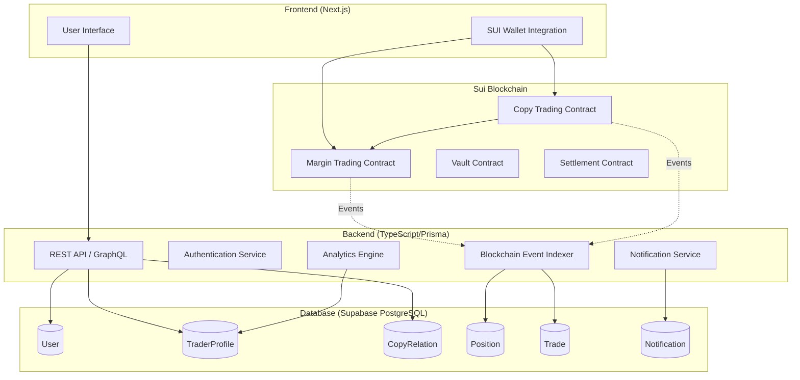
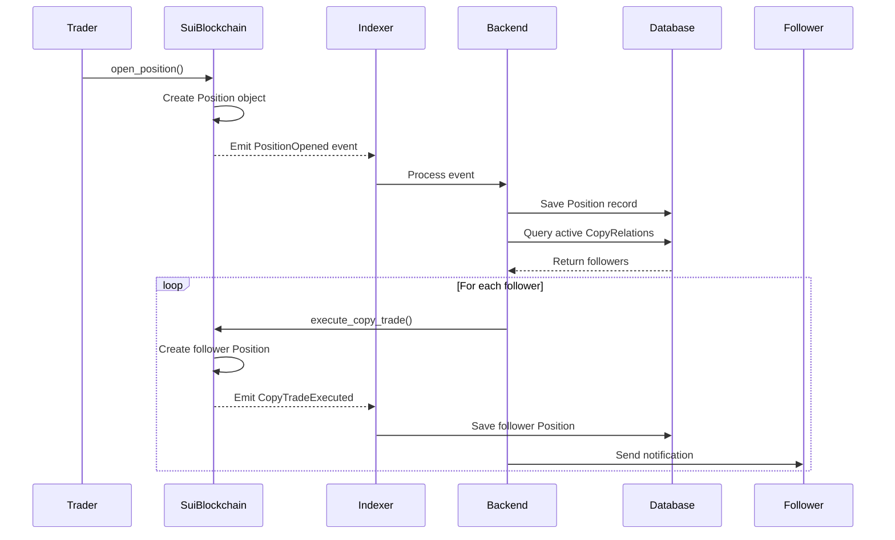

# MarginMaster DeFi Copy Trading Platform - Architecture Specification

**Document Version:** 1.0
**Date:** 2026-02-03
**Status:** Draft
**Author:** SUI Architect Agent

---

## Executive Summary

MarginMaster is a hybrid DeFi copy trading platform that combines:
- **Off-chain Backend** (TypeScript/Node.js/Prisma/Supabase) for social features, analytics, and user management
- **On-chain Smart Contracts** (Sui Move) for financial operations, margin trading, and settlement

**Key Differentiators:**
- Real-time copy trading with configurable ratios (0-1x)
- Advanced risk management (max position size, stop-loss, take-profit)
- Event-driven synchronization between on-chain and off-chain state
- Gas-optimized batch execution for copy trades

---

## 1. Architecture Overview

### 1.1 System Components



### 1.2 Data Flow

**Trade Execution Flow:**
```
1. Trader opens position → Sui Move contract
2. Contract emits PositionOpened event
3. Backend indexer catches event
4. Query CopyRelation table for active followers
5. Calculate copy trades (copyRatio, risk limits)
6. Submit batch copy transactions to blockchain
7. Update Position & Trade tables
8. Send notifications to followers
```

---

## 2. Database Schema Design (Task #5)

### 2.1 Remaining Models to Implement

#### 2.1.1 Position Model

**Purpose:** Track all trading positions (both trader and follower positions)

```typescript
model Position {
  id                String   @id @default(uuid())
  userId            String   @map("user_id")
  tradingPairId     String   @map("trading_pair_id")
  positionType      String   @map("position_type")     // "LONG" | "SHORT"
  entryPrice        Float    @map("entry_price")
  currentPrice      Float?   @map("current_price")
  quantity          Float
  leverage          Float
  margin            Float
  unrealizedPnL     Float?   @map("unrealized_pnl")
  realizedPnL       Float?   @map("realized_pnl")
  stopLossPrice     Float?   @map("stop_loss_price")
  takeProfitPrice   Float?   @map("take_profit_price")
  status            String   @default("OPEN")           // "OPEN" | "CLOSED" | "LIQUIDATED"

  // Copy trading metadata
  isCopyTrade       Boolean  @default(false) @map("is_copy_trade")
  originalPositionId String? @map("original_position_id")
  copyRelationId    String?  @map("copy_relation_id")

  // Blockchain references
  onChainPositionId String?  @unique @map("on_chain_position_id")
  txHash            String?  @map("tx_hash")

  openedAt          DateTime @default(now()) @map("opened_at")
  closedAt          DateTime? @map("closed_at")
  createdAt         DateTime @default(now()) @map("created_at")
  updatedAt         DateTime @updatedAt @map("updated_at")

  // Relations
  user              User     @relation(fields: [userId], references: [id], onDelete: Cascade)
  tradingPair       TradingPair @relation(fields: [tradingPairId], references: [id])
  originalPosition  Position? @relation("CopyPosition", fields: [originalPositionId], references: [id])
  copiedPositions   Position[] @relation("CopyPosition")
  copyRelation      CopyRelation? @relation(fields: [copyRelationId], references: [id])
  trades            Trade[]

  @@index([userId])
  @@index([status])
  @@index([onChainPositionId])
  @@index([originalPositionId])
  @@map("positions")
}
```

**Key Features:**
- Tracks both original trader positions and copied follower positions
- Links to on-chain position ID for blockchain sync
- Supports stop-loss and take-profit orders
- Records PnL (unrealized and realized)

#### 2.1.2 TradingPair Model

**Purpose:** Define available trading pairs (e.g., BTC/USDC, ETH/USDC)

```typescript
model TradingPair {
  id          String    @id @default(uuid())
  symbol      String    @unique                        // "BTC/USDC"
  baseAsset   String    @map("base_asset")            // "BTC"
  quoteAsset  String    @map("quote_asset")           // "USDC"
  isActive    Boolean   @default(true) @map("is_active")
  minQuantity Float     @map("min_quantity")
  maxLeverage Float     @map("max_leverage")
  createdAt   DateTime  @default(now()) @map("created_at")
  updatedAt   DateTime  @updatedAt @map("updated_at")

  // Relations
  positions   Position[]
  trades      Trade[]

  @@index([symbol])
  @@index([isActive])
  @@map("trading_pairs")
}
```

#### 2.1.3 Trade Model

**Purpose:** Record all trade events (open, close, partial close, liquidation)

```typescript
model Trade {
  id              String   @id @default(uuid())
  positionId      String   @map("position_id")
  userId          String   @map("user_id")
  tradingPairId   String   @map("trading_pair_id")
  tradeType       String   @map("trade_type")          // "OPEN" | "CLOSE" | "PARTIAL_CLOSE" | "LIQUIDATION"
  side            String                               // "LONG" | "SHORT"
  price           Float
  quantity        Float
  value           Float                                // price * quantity
  fee             Float
  pnl             Float?                               // Only for CLOSE trades

  // Blockchain references
  txHash          String   @map("tx_hash")
  blockNumber     BigInt?  @map("block_number")

  executedAt      DateTime @default(now()) @map("executed_at")
  createdAt       DateTime @default(now()) @map("created_at")

  // Relations
  position        Position @relation(fields: [positionId], references: [id], onDelete: Cascade)
  user            User     @relation(fields: [userId], references: [id])
  tradingPair     TradingPair @relation(fields: [tradingPairId], references: [id])

  @@index([positionId])
  @@index([userId])
  @@index([txHash])
  @@index([executedAt])
  @@map("trades")
}
```

#### 2.1.4 Notification Model

**Purpose:** User notifications for position updates, copy trades, alerts

```typescript
model Notification {
  id          String    @id @default(uuid())
  userId      String    @map("user_id")
  type        String                                   // "POSITION_OPENED" | "POSITION_CLOSED" | "COPY_EXECUTED" | "STOP_LOSS_HIT" | "LIQUIDATION"
  title       String
  message     String    @db.Text
  data        Json?                                    // Additional structured data
  isRead      Boolean   @default(false) @map("is_read")
  readAt      DateTime? @map("read_at")
  createdAt   DateTime  @default(now()) @map("created_at")

  // Relations
  user        User      @relation(fields: [userId], references: [id], onDelete: Cascade)

  @@index([userId])
  @@index([isRead])
  @@index([createdAt])
  @@map("notifications")
}
```

#### 2.1.5 Update Existing Models

**User Model - Add Relations:**
```typescript
model User {
  // ... existing fields ...

  // Add new relations
  positions      Position[]
  trades         Trade[]
  notifications  Notification[]
}
```

**CopyRelation Model - Add Relations:**
```typescript
model CopyRelation {
  // ... existing fields ...

  // Add new relations
  copiedPositions Position[]
}
```

---

## 3. Sui Move Smart Contract Architecture

### 3.1 Module Structure

```
margin-master/
├── margin_trading/
│   ├── position.move          # Position management
│   ├── vault.move             # Fund custody
│   └── liquidation.move       # Liquidation logic
├── copy_trading/
│   ├── relation.move          # Copy relationship on-chain
│   ├── executor.move          # Copy trade execution
│   └── risk_manager.move      # Risk checks
├── settlement/
│   ├── pnl.move              # PnL calculation
│   └── settlement.move        # Position settlement
└── shared/
    ├── price_oracle.move     # Price feeds
    ├── events.move           # Event definitions
    └── errors.move           # Error codes
```

### 3.2 Core Data Structures

#### 3.2.1 Position Object

```move
module margin_master::position {
    use sui::object::{Self, UID};
    use sui::coin::{Self, Coin};
    use sui::balance::{Self, Balance};

    /// Represents a margin trading position
    struct Position has key, store {
        id: UID,
        owner: address,
        trading_pair: String,
        position_type: u8,      // 0 = LONG, 1 = SHORT
        entry_price: u64,
        quantity: u64,
        leverage: u8,
        margin: Balance<USDC>,
        stop_loss_price: Option<u64>,
        take_profit_price: Option<u64>,
        is_copy_trade: bool,
        original_position_id: Option<ID>,
        opened_at: u64,
    }

    /// Capability for position management
    struct PositionCap has key {
        id: UID,
    }
}
```

#### 3.2.2 Copy Relation Registry

```move
module margin_master::copy_trading {
    use sui::table::{Self, Table};
    use sui::object::{Self, UID, ID};

    /// On-chain copy relationship registry
    struct CopyRelationRegistry has key {
        id: UID,
        relations: Table<address, vector<CopyRelation>>,
    }

    struct CopyRelation has store {
        trader: address,
        follower: address,
        copy_ratio: u64,        // Basis points (0-10000)
        max_position_size: u64,
        is_active: bool,
    }
}
```

#### 3.2.3 Vault

```move
module margin_master::vault {
    use sui::coin::{Self, Coin};
    use sui::balance::{Self, Balance};

    /// Holds user deposits for margin trading
    struct Vault<phantom T> has key {
        id: UID,
        balance: Balance<T>,
        owner: address,
    }
}
```

### 3.3 Core Functions

#### 3.3.1 Open Position

```move
public entry fun open_position(
    vault: &mut Vault<USDC>,
    registry: &CopyRelationRegistry,
    trading_pair: String,
    position_type: u8,
    entry_price: u64,
    quantity: u64,
    leverage: u8,
    margin_amount: u64,
    ctx: &mut TxContext
): Position {
    // 1. Validate parameters
    assert!(leverage >= 1 && leverage <= 10, EInvalidLeverage);

    // 2. Deduct margin from vault
    let margin = balance::split(&mut vault.balance, margin_amount);

    // 3. Create position
    let position = Position {
        id: object::new(ctx),
        owner: tx_context::sender(ctx),
        trading_pair,
        position_type,
        entry_price,
        quantity,
        leverage,
        margin,
        stop_loss_price: option::none(),
        take_profit_price: option::none(),
        is_copy_trade: false,
        original_position_id: option::none(),
        opened_at: tx_context::epoch(ctx),
    };

    // 4. Emit event
    event::emit(PositionOpened {
        position_id: object::uid_to_inner(&position.id),
        owner: position.owner,
        trading_pair: position.trading_pair,
        position_type: position.position_type,
        entry_price: position.entry_price,
        quantity: position.quantity,
        leverage: position.leverage,
    });

    // 5. Check for copy followers and emit CopyTradeRequired event
    // (Backend indexer will execute copy trades)

    position
}
```

#### 3.3.2 Execute Copy Trade

```move
public entry fun execute_copy_trade(
    original_position_id: ID,
    follower_vault: &mut Vault<USDC>,
    copy_ratio: u64,  // Basis points
    ctx: &mut TxContext
) {
    // 1. Validate copy relationship exists
    // 2. Calculate copy position size
    // 3. Apply risk limits (max position size)
    // 4. Create follower position linked to original
    // 5. Emit CopyTradeExecuted event
}
```

#### 3.3.3 Close Position

```move
public entry fun close_position(
    position: Position,
    current_price: u64,
    vault: &mut Vault<USDC>,
    ctx: &mut TxContext
) {
    // 1. Calculate PnL
    let pnl = calculate_pnl(&position, current_price);

    // 2. Return margin + PnL to vault
    let total_return = position.margin + pnl;
    balance::join(&mut vault.balance, total_return);

    // 3. Emit event
    event::emit(PositionClosed {
        position_id: object::uid_to_inner(&position.id),
        owner: position.owner,
        pnl,
        close_price: current_price,
    });

    // 4. Destroy position
    let Position { id, margin, ... } = position;
    object::delete(id);
}
```

### 3.4 Event System

```move
module margin_master::events {
    struct PositionOpened has copy, drop {
        position_id: ID,
        owner: address,
        trading_pair: String,
        position_type: u8,
        entry_price: u64,
        quantity: u64,
        leverage: u8,
    }

    struct PositionClosed has copy, drop {
        position_id: ID,
        owner: address,
        pnl: u64,
        close_price: u64,
    }

    struct CopyTradeExecuted has copy, drop {
        original_position_id: ID,
        follower_position_id: ID,
        follower: address,
        copy_ratio: u64,
    }

    struct StopLossTriggered has copy, drop {
        position_id: ID,
        trigger_price: u64,
    }

    struct Liquidation has copy, drop {
        position_id: ID,
        owner: address,
        liquidation_price: u64,
    }
}
```

---

## 4. Integration Points

### 4.1 Event Synchronization Strategy

**Backend Event Indexer:**

```typescript
// services/blockchain-indexer.ts
class BlockchainIndexer {
  async startIndexing() {
    const suiClient = new SuiClient({ url: getFullnodeUrl('mainnet') });

    // Subscribe to position events
    await suiClient.subscribeEvent({
      filter: {
        MoveEventType: 'margin_master::events::PositionOpened'
      },
      onMessage: (event) => this.handlePositionOpened(event)
    });

    // Subscribe to copy trade events
    await suiClient.subscribeEvent({
      filter: {
        MoveEventType: 'margin_master::events::CopyTradeExecuted'
      },
      onMessage: (event) => this.handleCopyTradeExecuted(event)
    });
  }

  async handlePositionOpened(event: SuiEvent) {
    const { position_id, owner, trading_pair, entry_price, quantity, leverage } = event.parsedJson;

    // 1. Save position to database
    await prisma.position.create({
      data: {
        onChainPositionId: position_id,
        userId: await this.getUserIdBySuiAddress(owner),
        tradingPairId: await this.getTradingPairId(trading_pair),
        entryPrice: entry_price,
        quantity,
        leverage,
        status: 'OPEN',
        txHash: event.id.txDigest,
      }
    });

    // 2. Check for active copy relationships
    const copyRelations = await prisma.copyRelation.findMany({
      where: {
        trader: { suiAddress: owner },
        isActive: true,
      }
    });

    // 3. Execute copy trades for followers
    for (const relation of copyRelations) {
      await this.executeCopyTrade(position_id, relation);
    }
  }

  async executeCopyTrade(originalPositionId: string, relation: CopyRelation) {
    // 1. Calculate copy position size
    const copyQuantity = originalQuantity * relation.copyRatio;

    // 2. Apply risk limits
    if (relation.maxPositionSize && copyQuantity > relation.maxPositionSize) {
      // Skip or adjust
      return;
    }

    // 3. Submit transaction to blockchain
    const tx = new TransactionBlock();
    tx.moveCall({
      target: 'margin_master::copy_trading::execute_copy_trade',
      arguments: [
        tx.pure(originalPositionId),
        tx.object(followerVaultId),
        tx.pure(relation.copyRatio * 100), // Convert to basis points
      ]
    });

    await suiClient.signAndExecuteTransactionBlock({ ... });

    // 4. Send notification to follower
    await this.notificationService.send({
      userId: relation.followerId,
      type: 'COPY_EXECUTED',
      title: 'Copy Trade Executed',
      message: `Following ${traderUsername}'s position on ${tradingPair}`
    });
  }
}
```

### 4.2 Data Flow Diagram



---

## 5. Priority Implementation Order

### Phase 1: Database Schema Completion (Current - Task #5)
**Priority: HIGH**
**Estimated Time: 1-2 hours**

1. ✅ User Model (completed)
2. ✅ TraderProfile Model (completed)
3. ✅ CopyRelation Model (completed)
4. ⏳ TradingPair Model (next)
5. ⏳ Position Model
6. ⏳ Trade Model
7. ⏳ Notification Model

**Deliverable:** All database models with TDD tests (target: 50+ tests total)

### Phase 2: Sui Move Smart Contracts (Task #6)
**Priority: HIGH**
**Estimated Time: 3-4 hours**

1. Core modules setup
2. Position management (open/close)
3. Vault for fund custody
4. Copy trading executor
5. Event system
6. Testing with Sui CLI

**Deliverable:** Deployable Move packages with tests

### Phase 3: Backend Event Indexer
**Priority: MEDIUM**
**Estimated Time: 2-3 hours**

1. Sui event subscription service
2. Event handlers (PositionOpened, PositionClosed, CopyTradeExecuted)
3. Database synchronization logic
4. Copy trade execution orchestration

**Deliverable:** Real-time blockchain → database sync

### Phase 4: API & Frontend Integration
**Priority: MEDIUM**
**Estimated Time: 4-5 hours**

1. GraphQL/REST API endpoints
2. Frontend UI for position management
3. Wallet integration (Sui Wallet)
4. Real-time updates (WebSocket)

**Deliverable:** End-to-end demo

---

## 6. SUI Ecosystem Tool Integration

### 6.1 Recommended Tools

**Already Decided:**
- **Database:** Supabase PostgreSQL ✅
- **Blockchain:** Sui Move ✅

**Additional Integrations:**

1. **Price Oracle:**
   - **Tool:** Pyth Network (Sui integration)
   - **Purpose:** Real-time price feeds for liquidation/settlement
   - **Integration:** `sui-pyth` module

2. **Storage (Optional):**
   - **Tool:** Walrus (decentralized storage)
   - **Purpose:** Store trade history snapshots, analytics data
   - **Integration:** `sui-walrus`

3. **Authentication:**
   - **Tool:** zkLogin or Passkey
   - **Purpose:** Passwordless login with social accounts
   - **Integration:** `sui-zklogin` or `sui-passkey`

4. **Name Service (Optional):**
   - **Tool:** SuiNS
   - **Purpose:** Human-readable trader addresses (e.g., trader.sui)
   - **Integration:** `sui-suins`

### 6.2 Integration Priority

**Must-Have:**
- Price Oracle (Pyth) - Required for liquidation logic

**Nice-to-Have:**
- zkLogin - Improves UX
- SuiNS - Better trader discovery
- Walrus - Decentralized analytics storage

---

## 7. Security Considerations

### 7.1 Smart Contract Security

**Risks:**
1. **Reentrancy:** Position close → vault withdrawal
   - **Mitigation:** Use Sui's object model (no reentrancy by design)

2. **Integer Overflow:** PnL calculation
   - **Mitigation:** Use checked arithmetic

3. **Unauthorized Access:** Only position owner can close
   - **Mitigation:** Capability-based access control

4. **Price Oracle Manipulation:**
   - **Mitigation:** Use trusted oracles (Pyth), add staleness checks

### 7.2 Backend Security

**Risks:**
1. **Event Replay:** Duplicate position creation
   - **Mitigation:** Track processed transaction hashes

2. **Copy Trade Spam:** Malicious rapid trading
   - **Mitigation:** Rate limiting, min trade size

3. **Data Integrity:** Off-chain vs on-chain mismatch
   - **Mitigation:** Periodic reconciliation jobs

---

## 8. Testing Strategy

### 8.1 Database Tests (Jest + Prisma)
- Unit tests for each model (already 28/28 passed ✅)
- Integration tests for complex queries
- Target: 50+ tests total

### 8.2 Smart Contract Tests (Sui Move Test Framework)
```bash
sui move test
```
- Unit tests for each module
- Integration tests for multi-module flows
- Target: 30+ tests

### 8.3 End-to-End Tests (Playwright)
- User opens position → followers copy automatically
- Position close → PnL settlement
- Stop-loss trigger → auto close

---

## 9. Deployment Plan

### 9.1 Smart Contract Deployment

```bash
# 1. Deploy to Devnet
sui client publish --gas-budget 100000000

# 2. Test on Devnet
# ... run integration tests ...

# 3. Deploy to Testnet
sui client publish --gas-budget 100000000 --network testnet

# 4. Mainnet deployment (after audit)
sui client publish --gas-budget 100000000 --network mainnet
```

### 9.2 Backend Deployment

```bash
# 1. Database migration
npx prisma migrate deploy

# 2. Deploy to Vercel/Railway
# ... CI/CD pipeline ...
```

---

## 10. Next Steps

### Immediate (Ralph Loop Iteration 2):
1. ✅ Complete database schema (TradingPair, Position, Trade, Notification)
2. ✅ Write TDD tests for new models
3. ✅ Run migrations to Supabase

### Next Session (Ralph Loop Iteration 3):
1. Implement Sui Move smart contracts
2. Set up event indexer
3. Integration testing

---

## Appendix

### A. References
- [Sui Move Documentation](https://docs.sui.io/build/move)
- [Prisma Best Practices](https://www.prisma.io/docs/guides/performance-and-optimization)
- [Pyth Oracle Integration](https://docs.pyth.network/documentation/sui)

### B. Tool Versions
- Sui: v1.x (latest)
- Prisma: 5.22.0
- Node.js: 20.x
- TypeScript: 5.x

---

**END OF SPECIFICATION**
